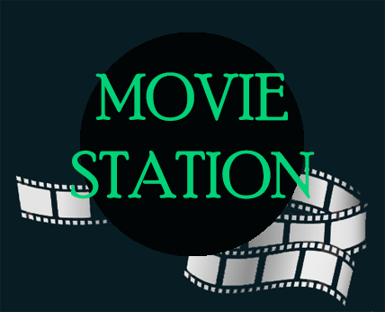
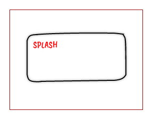
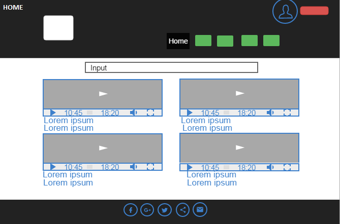
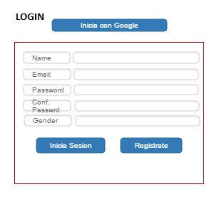
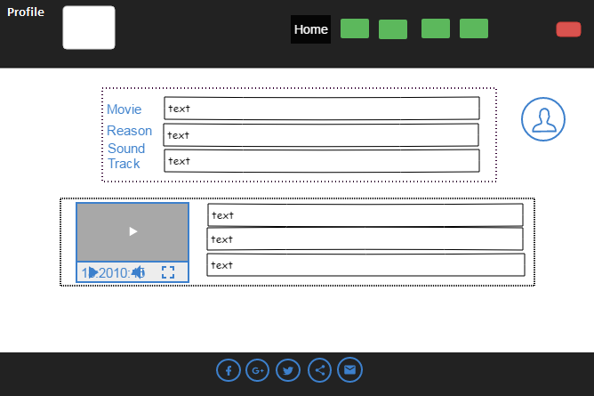
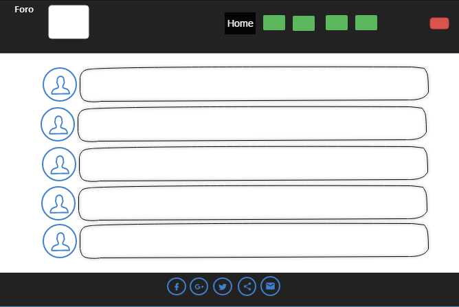
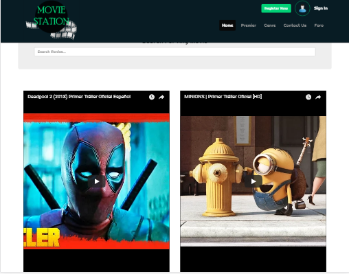
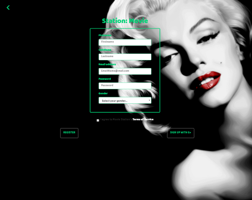
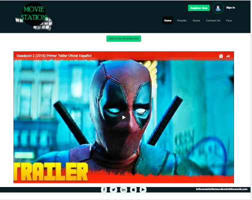
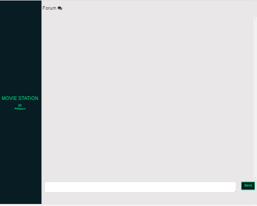

# Movie Station
 Es una web que hace un registro de las películas que viste. Accediendo a tu perfil con autenticación con google podras hacer la busqueda y añadir la película a una lista de favoritos.

## Desarrollado para 
[Laboratoria](http://laboratoria.la)

# PROYECTO: MOVIE STATION
# BAJO EL LEMA: Disfruta como en el cine...

 

# NOMBRE DE PARTICIPANTES
	
*   Mariela Cerna Peralta: UX-UI  

   - Encargada del desarrollo de entrevistas y maquetación creación de logo y definición del color, recopilación de información sobre experiencias de usuario, anotaciones sobre sus requerimientos para mejorar su experiencia futura, se utilizó herramientas de fácil alcance como papel y lápiz para dibujar los sketches (diseño básico).

*   Franshesca Quezada: UX-UI  

    - Encargada de maquetación, definición de color, tipografías y definición de nombre junto con el equipo de trabajo, además de recopilar información sobre experiencias de usuario, utilizó herramientas de fácil alcance como papel y lápiz para dibujar los sketches (diseño básico).

*   Claudia Garibotto: FRONT-END DEVELOPER  

    - Encargada de la funcionalidad del producto, además junto con el equipo de UX, UI, recopila información sobre las experiencias de los usuarios, analiza y desarrolla el producto.

*   Yanina Mercado: FRONT-END DEVELOPER  

    - Encargada de la funcionalidad del producto, además junto con el equipo de UX, UI, recopila información sobre las experiencias de los usuarios, analiza y desarrolla el producto.
    
### METODOS DE LEVANTAMIENTO DE INFORMACION.
* Entrevista
   -  En persona con el usuario.
   -  Virtual por medio de Whatsapp y audios.

* Herramienta de trabajo.
   -  Celular, lápiz y papel.
 
### NUESTRO CLIENTE NOS INFORMO ALGUNOS PUNTOS BASICO.
*  La aplicación debe hacer uso de Api Open Movie DataBase. 
*  Debe existir funcionalidad para crear listas de videos favoritos.

### ¿QUÉ SE REQUIERE?
* Trabajar en equipos.
* Tener una planificación.
* La definición del diseño.
* Desplegar el producto en Github Pages.
* Opcional uso de perfil por usuario.
* Respaldar la idea del producto.

### PROCESOS DE DISEÑO DE LA EXPERIENCIA
-  Se analiza el fondo un tema que creemos podría ser viable, se llega a un acuerdo y se procede a entrevistar.
- La experiencia de usuario es enriquecedora, se procede a realizar los diseños básicos solo papel y lápiz para dibujar los sketches y volver a revisarlo una o las veces que sea necesario hasta que el producto tome forma y usabilidad.
- Volvemos a entrevistar de forma más detallada y así profundizar cual es el factor determinante que mejorara la experiencia de usuario.
- Se procede a diseñar los maquetados, cada una de las vistas desktop Tablet y Mobile.
- Luego se le adiciona funcionalidad, rapidez y simpleza, que sea entendible al usuario y su experiencia sea enriquecedora. Se realizaron las pruebas de funcionalidad.

### Lista de SKETCHES.

* SPLASH:  
 

* HOME:  
 

* LOGIN:  
 

* PROFILE:  

* FORO:  

### Herramientas de trabajo.
* Utilizamos framework Bootstrap 3.1
* Programación en Jquery.
* Uso de Firebase para autenticación.
* HTML5.
* @media query.

### ELEMENTOS QUE SE UTILIZACION EN LA CREACIÓN DE APP Y WEB STATION MOVIE..
*	Se creó un logotipo en Photoshop.
*	Definición de paleta de colores y diseño de cada una de las views.
*	Se utiliza la herramienta Firebase de la cual se usa la base de datos en tiempo real. Asimismo, se utiliza el módulo de autenticación para la función de “Login” utilizando la cuenta de usuario en gmail.
*	Después de iniciar un registro previo las vistas están compuestas por: splash, home, login, profile, foro y modal de autenticación.

### PRESENTACIÓNN DEL PRODUCTO.
* Se crea un repositorio.
*	Se crea página gh-pages para guardar información de commit adicionales por cada colaborador.
*	Trabajo en equipo.

## USO DE API OPEN MOVIE DATABASE Y FIREBASE

*	La utilización de firebase, facilita al usuario el uso del login, porque evita tener que llenar el formulario de registro, puede acceder al portal directamente con su cuenta de usuario de gmail.
*	Esta API nos da acceso a las películas, data con la que se trabaja la aplicación Movie Station, y su funcionalidad de búsquedas de película.

## VISTAS: MOVIE STATION

- Vista inicial 
  En esta se presenta el logo en una ventana splash con una duración de 3 segundos.
- Vista Home 
  Donde muestra todas las películas y libre acceso para realizar búsquedas de películas.
- Vista Login
  Acceso a registro mediante un formulario, nos muestra dos opciones, el registro directo con cualquier cuenta y el registro con GMAIL.
-	Vista Profile
  En esta vista están listadas todas las películas que el usuario guarda, además presenta un buscador donde se puede seleccionar la película que se quiere volver a ver directamente desde el perfil.
-	Vista Foro
  En esta vista es posible realizar un chat en tiempo real, con usuarios que les guste la película o que tengan algo que comentar sobre ella.

## Vistas de la App. MOVIE STATION.

